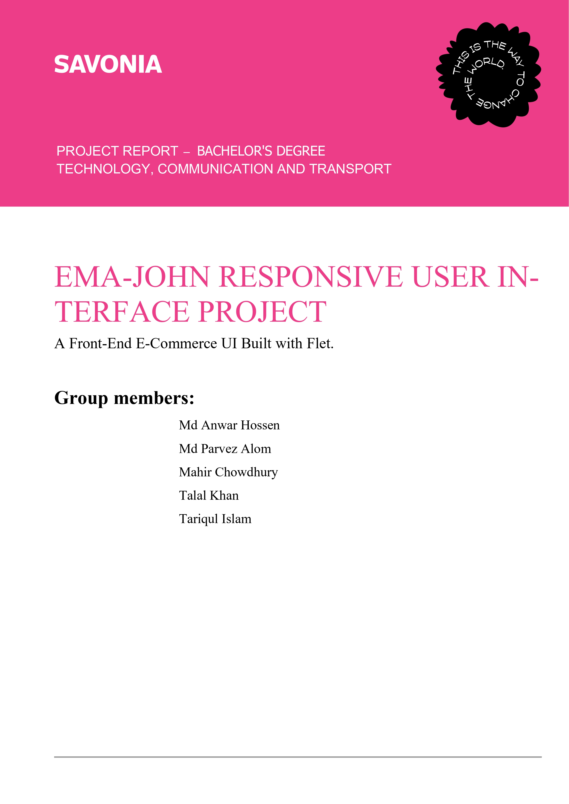

# Ema-John Responsive User Interface Project

_A Front-End E-Commerce UI Built with Flet_

---

## Executive Summary

The EMA-JOHN project is a conceptual e-commerce application designed to demonstrate the capabilities of the Flet framework for building responsive, cross-platform user interfaces entirely in Python.

The application simulates a functional online store—product browsing, searching, sorting, dynamic cart handling, mock login, and multi-step checkout. It showcases how a single Python codebase can deliver a desktop-grade responsive UI adaptable to both mobile and large displays.

---

## Project Details

| Field            | Detail                               |
| ---------------- | ------------------------------------ |
| **Project Name** | EMA-JOHN E-Commerce Platform         |
| **Framework**    | Flet (Python UI Framework)           |
| **Data Source**  | Remote JSON file with local fallback |

---

## Project Goals & Objectives

- Build a fully responsive UI that adapts to all screen sizes using Flet’s responsive controls.
- Implement key e-commerce functions: product listing, filtering, dynamic cart, checkout simulation.
- Demonstrate advanced Flet capabilities including `ResponsiveRow`, `ListView`, and modular state management.
- Provide a seamless multi-step flow: Home → Cart → Login → Checkout → Confirmation.

---

## Technical Architecture & Implementation

### Framework & Language

- **Language:** Python
- **UI Framework:** Flet
- **Data Source:** Remote JSON using `urllib.request`, with local fallback.

### Data & State

- **products:** List of dictionaries loaded at startup.
- **cart:** Dictionary keyed by product ID storing product details & quantities.
- **Authentication:** `is_logged_in` and `login_redirect_target` track authentication state.

### Core Functions

| Function                     | Purpose                                                         |
| ---------------------------- | --------------------------------------------------------------- |
| `safe_load_products`         | Loads remote JSON safely with fallback data.                    |
| `recalc_totals`              | Recomputes cart subtotal, shipping, and grand total.            |
| `refresh_cart_ui`            | Updates cart visuals and summary figures.                       |
| `add_to_cart` / `change_qty` | Business logic handling item addition/removal and stock checks. |
| `on_search_or_sort`          | Real-time product filtering & sorting.                          |
| `render_*`                   | Modular UI view rendering.                                      |

---

## Feature Showcase

### Responsive Layout

- Uses `ResponsiveRow` to adapt product grid and cart summary.
- Layout responds to breakpoints:
  - **Desktop:** 3–4 product cards per row.
  - **Mobile:** Stacks vertically with full-width components.

### Dynamic Cart & Totals

- Real-time updates on quantity change.
- Automatic recomputation of totals.
- Clear and interactive UI controls.

### Multi-Step Checkout

1. **Review Order**
2. **Login (if required)**
3. **Checkout**
4. **Order Confirmation**

### UI/UX Highlights

- Clean product cards with price, rating, stock, seller information.
- Snackbars for action feedback.
- Login button dynamically switches to logout mode.

---

## Team Roles & Contributions

| Member               | Role                        | Contribution                                                         |
| -------------------- | --------------------------- | -------------------------------------------------------------------- |
| **Md Anwar Hossen**  | Project Manager & Architect | System architecture, Agile sprint planning, Git workflow leadership. |
| **Md Parvez Alam**   | CRUD Operations             | Remote product fetching & local fallback implementation.             |
| **Talal Khan**       | Cart & State Logic          | Cart operations, calculations, local storage (if used).              |
| **Mahir Chowdhury**  | Authentication              | Login UI & authentication flow.                                      |
| **Md Tariqul Islam** | Filter & Sorting            | Real-time filtering and sorting implementation.                      |

---

## Challenges & Solutions

| Challenge                  | Solution                                                              |
| -------------------------- | --------------------------------------------------------------------- |
| Inconsistent state updates | Centralized state-modifying logic with a unified UI refresh function. |
| User state persistence     | Local storage used to preserve cart & login state.                    |
| CORS/backend issues        | `urllib.request` avoids browser-like CORS restrictions.               |
| Mobile layout issues       | Explicit breakpoints for all views.                                   |
| Merge conflicts            | Feature-branch workflow with small, frequent commits.                 |

---

## Discussion & Conclusion

This project strengthened the team’s understanding of Flet and modern UI development. Key takeaways include:

- Efficient state management across dynamic views.
- Building fully responsive layouts in Python.
- Team coordination with clear, modular responsibilities.

The final product is a functional, modern e-commerce UI demo with potential for future expansion through backend integration and persistent data handling.

---

_© 2025 EMA-JOHN Project Team_
